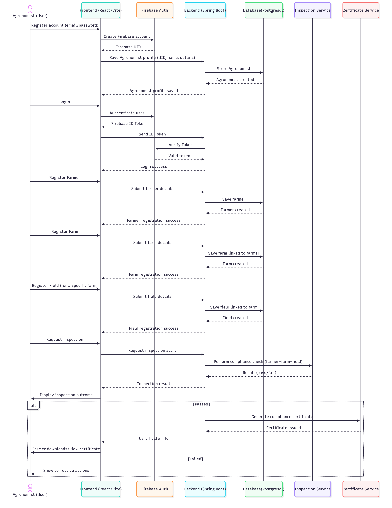

#  Organic-Certified

Welcome to **Organic-Certified**\! This project is a dynamic single-page application built with **React** . It serves as a user-friendly platform for agronomists to register farmers,farms,fields. And isuse a compliance certificate if a farmer meets some conditions.

##  Features

  * **Register and Login an Agronomist** An agronomist is able to register and login to use the platform
  * **Register A farmer:** An agronomist can Register a Farmer
  * **Register A farm, Field** After Registering a Farmer, an Agronomist can register farms and Fields under the farmer
  * **Start an Inpection** :This is done through a set of questions asked to the farmer
   * **Issue Compliance Certificate** :If a Farmer passes the compliance checks they are successfully issued a downloadable Compliance certificate 
  * **Responsive Design:** The application is fully responsive, providing a great user experience on both desktop and mobile devices.

-----

##  Technologies Used

This project is built using modern web development technologies to ensure a fast, scalable, and maintainable codebase.

  * **React:** A powerful JavaScript library for building user interfaces.
 
  * **Vite:** A fast build tool that provides an efficient development environment.
  * **React Router:** For seamless client-side routing and navigation.
 

-----

## Getting Started

To get a local copy of this project up and running, follow these simple steps.

### Prerequisites

Before you begin, ensure you have **Node.js** and **npm** (or **Yarn**) installed on your machine.

  * **Node.js**: [Download from here](https://nodejs.org/)
  * **npm**: Comes with Node.js
  * **Yarn**: You can install it globally via `npm install --global yarn`

### Installation

1.  **Clone the repository:**
    ```bash
    git clone [your-repository-url]
    cd [your-repository-name]
    ```
2.  **Install dependencies:**
    ```bash
    npm install
    # or if you use Yarn
    yarn install
    ```

-----


##  Running the Application

To run the application in development mode:

```bash
npm run dev
# or with Yarn
yarn dev
```

The app will be available at `http://localhost:5173`.

Live Link to view the project `https://organic-certification-frontend-kappa.vercel.app/register`

Backend Link `https://github.com/Rhonajoy/organic-certification-backend`
Api Documentation `https://organic-certification-backend-production.up.railway.app/swagger-ui/index.html`

##  System Workflow


   

##  License

Copyright (c) 2025 RhonaJoy

Permission is hereby granted, free of charge, to any person obtaining a copy of this software and associated documentation files , to deal in the Software without restriction, including without limitation the rights to use, copy, modify, merge, publish, distribute, sublicense, and/or sell copies of the Software, and to permit persons to whom the Software is furnished to do so, subject to the following conditions:

The above copyright notice and this permission notice shall be included in all copies or substantial portions of the Software.

THE SOFTWARE IS PROVIDED "AS IS", WITHOUT WARRANTY OF ANY KIND, EXPRESS OR IMPLIED, INCLUDING BUT NOT LIMITED TO THE WARRANTIES OF MERCHANTABILITY, FITNESS FOR A PARTICULAR PURPOSE AND NONINFRINGEMENT. IN NO EVENT SHALL THE AUTHORS OR COPYRIGHT HOLDERS BE LIABLE FOR ANY CLAIM, DAMAGES OR OTHER LIABILITY, WHETHER IN AN ACTION OF CONTRACT, TORT OR OTHERWISE, ARISING FROM, OUT OF OR IN CONNECTION WITH THE SOFTWARE OR THE USE OR OTHER DEALINGS IN THE SOFTWARE.

-----

